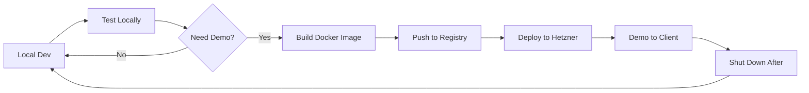

# LOCAL DEV → HETZNER DEMO Strategy
## Low-Cost Development & Deployment for Solo Developer

**Version:** 2.0 (Realistic Edition)
**Date:** November 4, 2025
**Author:** Big Dick & Claude
**Budget:** <$30/month for demos
**Status:** 🟢 PRACTICAL

---

## 1. THE REALITY CHECK

### What You Actually Have (in D:\VarnaAI\Old)

| App | Tech Stack | Current State | Demo Priority |
|-----|------------|--------------|---------------|
| **AgenticCoder** | FastAPI + React + Docker | Has docker-compose | HIGH (flagship) |
| **Dashboard (C3)** | Node/TS + Ollama | Has local LLM setup | HIGH (unique selling point) |
| **FwChange** | Unknown | Folder exists | MEDIUM |
| **ProjectManager** | Unknown | Folder exists | MEDIUM |
| **VarnaAI Platform** | Next.js + NestJS | Monorepo | HIGH (main platform) |
| **Pension (RetirementAI)** | Unknown | Folder exists | LOW (YMYL) |
| **VarnaAccounting** | Unknown | Folder exists | LOW |
| **SEOAgent** | Unknown | Folder exists | LOW |

### Real Costs vs Fantasy

**Fantasy (Previous PRD):**
- Hetzner AX41: €39/month
- Everything production-ready
- Complex orchestration

**Reality (This PRD):**
- Hetzner CX22: €7.31/month (demo only)
- Local development primary
- Deploy only when showing clients
- Ollama runs locally (not on server)

---

## 2. LOCAL DEVELOPMENT SETUP

### Your Dev Machine = Primary Environment

```yaml
Your Windows Machine:
  Primary Work: ALL development happens here

  Docker Desktop:
    - PostgreSQL (single instance, multiple DBs)
    - Redis
    - MongoDB (if needed)
    - NO production data

  Local Services:
    - Ollama (http://localhost:11434)
    - Your apps (localhost:3000, 3001, etc.)
    - Traefik (optional, for local routing)

  VS Code + Extensions:
    - Remote SSH (for Hetzner)
    - Docker
    - REST Client
```

### Local Ollama Setup (For AI Features)

```bash
# Install Ollama locally (Windows)
# Download from https://ollama.ai/download/windows

# Pull models you need
ollama pull llama3.2:3b        # Small, fast (2GB)
ollama pull codellama:7b       # Code-specific (4GB)
ollama pull mistral:7b-instruct # Good general (4GB)

# Total disk: ~10GB
# RAM needed: 8-16GB
# GPU: Optional but helps
```

**Cost:** $0 (runs on your machine)

### Docker Compose for Local Dev

```yaml
# D:\VarnaAI\local-dev-stack\docker-compose.yml
version: '3.8'

services:
  # Single PostgreSQL for ALL apps
  postgres:
    image: postgres:15-alpine
    environment:
      POSTGRES_PASSWORD: localdev
    ports:
      - "5432:5432"
    volumes:
      - postgres_data:/var/lib/postgresql/data
      - ./init-databases.sql:/docker-entrypoint-initdb.d/init.sql

  # Single Redis for ALL apps
  redis:
    image: redis:7-alpine
    ports:
      - "6379:6379"
    volumes:
      - redis_data:/data

  # Adminer (database UI)
  adminer:
    image: adminer:latest
    ports:
      - "8080:8080"
    depends_on:
      - postgres

volumes:
  postgres_data:
  redis_data:
```

```sql
-- init-databases.sql
CREATE DATABASE agenticcoder;
CREATE DATABASE c3_dashboard;
CREATE DATABASE fwchange;
CREATE DATABASE projectmanager;
CREATE DATABASE varnaai_platform;
CREATE DATABASE webhookhub;
```

---

## 3. HETZNER MINIMAL SETUP (DEMOS ONLY)

### Server Choice: CX22 (Cheapest Viable)

```yaml
Hetzner CX22:
  Price: €7.31/month ($8)
  CPU: 2 vCPU (shared)
  RAM: 4 GB
  Storage: 40 GB NVMe
  Transfer: 20 TB
  Location: Nuremberg

Purpose:
  - Demo 1-2 apps at a time
  - NOT for all apps simultaneously
  - NOT for production
  - Turn off when not demoing
```

### What Runs on Hetzner

```yaml
Deployed for Demos:
  - 1 main app (e.g., AgenticCoder)
  - PostgreSQL (demo data only)
  - Redis
  - Nginx/Traefik
  - NOT Ollama (too heavy)

API-Only Mode:
  - Frontend: Vercel/Netlify (free)
  - Backend: Hetzner CX22
  - Database: Hetzner or Supabase free
```

---

## 4. DEPLOYMENT WORKFLOW

### Development Cycle



### Step 1: Develop Locally

```bash
# Work in your app folder
cd D:\VarnaAI\Old\agenticcoder

# Run local services
docker-compose up -d postgres redis

# Run app locally
npm run dev  # or python manage.py runserver

# Test with local Ollama
curl http://localhost:11434/api/generate -d '{
  "model": "llama3.2",
  "prompt": "Write a function"
}'
```

### Step 2: Dockerize for Demo

```dockerfile
# Dockerfile.demo (simplified)
FROM node:20-alpine
WORKDIR /app
COPY package*.json ./
RUN npm ci --production
COPY . .
ENV NODE_ENV=production
CMD ["npm", "start"]
```

### Step 3: Deploy Script

```bash
#!/bin/bash
# deploy-demo.sh

# 1. Build locally
docker build -t myapp:demo -f Dockerfile.demo .

# 2. Save image
docker save myapp:demo | gzip > myapp-demo.tar.gz

# 3. Copy to Hetzner
scp myapp-demo.tar.gz root@hetzner:/tmp/

# 4. SSH and load
ssh root@hetzner << 'EOF'
  cd /tmp
  gunzip -c myapp-demo.tar.gz | docker load
  cd /opt/demos
  docker-compose down
  docker-compose up -d myapp
EOF

echo "Demo deployed! Access at: http://your-hetzner-ip:3000"
```

### Step 4: After Demo

```bash
# SHUT IT DOWN TO SAVE MONEY
ssh root@hetzner "docker-compose -f /opt/demos/docker-compose.yml down"

# Or snapshot and destroy server entirely
# Restore from snapshot when needed (€0.12/GB/month)
```

---

## 5. COST BREAKDOWN

### Monthly Costs (Realistic)

| Item | Cost | When You Pay |
|------|------|--------------|
| **Hetzner CX22** | €7.31 | Only when demoing |
| **Hetzner Snapshot** | €0.50 | Keep server state |
| **Domains** | $2 | Always |
| **Cloudflare** | $0 | Free tier |
| **GitHub** | $0 | Public repos |
| **Vercel/Netlify** | $0 | Frontend hosting |
| **Supabase** | $0 | Database (3 projects free) |
| **Total (Idle)** | **$2** | When not demoing |
| **Total (Demo)** | **$10** | When showing clients |

### Annual: ~$50-120 (depending on demo frequency)

---

## 6. LOCAL LLM STRATEGY

### Ollama Integration Pattern

```javascript
// config.js - Smart LLM routing
const LLM_CONFIG = {
  development: {
    provider: 'ollama',
    baseUrl: 'http://localhost:11434',
    model: 'llama3.2:3b',
    fallback: null
  },
  demo: {
    provider: 'openai',  // Use API for demos
    apiKey: process.env.OPENAI_API_KEY,
    model: 'gpt-3.5-turbo',
    maxCost: 5.00  // $5 limit per demo
  },
  production: {
    provider: 'anthropic',
    apiKey: process.env.ANTHROPIC_API_KEY,
    model: 'claude-3-haiku'
  }
};

// Smart routing
async function getLLMResponse(prompt) {
  const config = LLM_CONFIG[process.env.NODE_ENV];

  if (config.provider === 'ollama') {
    // Use local Ollama
    return fetch(`${config.baseUrl}/api/generate`, {
      method: 'POST',
      body: JSON.stringify({
        model: config.model,
        prompt: prompt
      })
    });
  } else {
    // Use cloud API for demos
    return callCloudAPI(config, prompt);
  }
}
```

### Ollama Models by Use Case

| Use Case | Model | Size | RAM | Speed |
|----------|-------|------|-----|-------|
| **Code Generation** | codellama:7b | 4GB | 8GB | Medium |
| **German Text** | mistral:7b-instruct | 4GB | 8GB | Fast |
| **Quick Responses** | llama3.2:3b | 2GB | 4GB | Very Fast |
| **Embeddings** | nomic-embed-text | 250MB | 1GB | Instant |
| **Vision** | llava:7b | 4GB | 8GB | Slow |

---

## 7. DEMO PREPARATION CHECKLIST

### 24 Hours Before Demo

```markdown
- [ ] Test app locally with demo data
- [ ] Build Docker image
- [ ] Spin up Hetzner CX22 (or restore snapshot)
- [ ] Deploy app to Hetzner
- [ ] Test all features work
- [ ] Prepare demo script
- [ ] Have local fallback ready
```

### Demo Day

```markdown
- [ ] Check Hetzner is running
- [ ] Verify app accessible
- [ ] Clear Redis cache
- [ ] Reset demo database if needed
- [ ] Have backup plan (local ngrok)
```

### After Demo

```markdown
- [ ] Export any demo feedback/data
- [ ] Stop Docker containers
- [ ] Create snapshot (€0.50/month)
- [ ] Destroy server OR power off
- [ ] Document what worked/didn't
```

---

## 8. PROGRESSIVE SCALING

### Stage 1: Local Only (Now)
- Everything runs locally
- Use ngrok for quick shares
- $0/month

### Stage 2: Demo Mode (First Client)
- Hetzner CX22 on-demand
- Deploy for demos only
- ~$10/month when active

### Stage 3: Always-On Demo (5+ Prospects)
- Keep CX22 running
- Multiple demo accounts
- €7.31/month constant

### Stage 4: Real Customers (Revenue)
- Upgrade to CX42 (€16/month)
- Add monitoring
- Add backups
- Still <$30/month

### Stage 5: Scale (10+ Customers)
- Move to AX42 dedicated
- Add redundancy
- ~€39/month

---

## 9. SMART SHORTCUTS

### Free Alternatives to Consider

```yaml
Frontend Hosting:
  - Vercel: 100GB bandwidth free
  - Netlify: 100GB bandwidth free
  - GitHub Pages: Unlimited for static
  - Cloudflare Pages: Unlimited

Databases:
  - Supabase: 3 projects, 500MB each
  - Neon: 3GB storage free
  - PlanetScale: 5GB free
  - MongoDB Atlas: 512MB free

APIs/Services:
  - Anthropic: $5 free credits
  - OpenAI: $5 free credits initially
  - Cloudflare Workers: 100k requests/day free
  - Upstash Redis: 10k commands/day free
```

### The "Fake It Till You Make It" Stack

```yaml
Month 1-3:
  Frontend: Vercel (free)
  Backend: Your laptop + ngrok
  Database: Supabase (free)
  LLM: Local Ollama
  Cost: $0

Month 4-6:
  Frontend: Vercel (free)
  Backend: Hetzner CX22 (on-demand)
  Database: Hetzner PostgreSQL
  LLM: Mix of Ollama + API credits
  Cost: ~$10/month

Month 7+:
  Everything on Hetzner CX42
  Proper monitoring
  Daily backups
  Cost: ~$20-30/month
```

---

## 10. ACTUAL NEXT STEPS

### Today (0 Cost)

1. **Setup Local Dev Stack**
```bash
cd D:\VarnaAI
mkdir local-dev-stack
# Copy docker-compose.yml from above
docker-compose up -d
```

2. **Install Ollama**
```bash
# Download from ollama.ai
ollama pull llama3.2:3b
ollama pull codellama:7b
```

3. **Pick ONE App to Focus On**
- Recommend: AgenticCoder or C3 Dashboard
- These already have Docker setup

### This Week ($0)

1. **Get App Running Locally**
```bash
cd D:\VarnaAI\Old\agenticcoder
docker-compose up -d
npm install
npm run dev
```

2. **Create Demo Data**
- 5-10 example records
- Test user accounts
- Sample outputs

3. **Document Everything**
- README with setup steps
- Demo script
- Known issues

### When You Have a Demo Scheduled ($8)

1. **Spin Up Hetzner CX22**
```bash
# Use Hetzner Cloud Console
# Pick Ubuntu 22.04
# Add SSH key
```

2. **Quick Deploy**
```bash
# Install Docker
curl -fsSL https://get.docker.com | sh

# Copy your app
scp -r myapp root@hetzner:/opt/

# Run it
ssh root@hetzner
cd /opt/myapp
docker-compose up -d
```

3. **Demo Successfully**
4. **Shut Down After**

---

## 11. GOTCHAS & SOLUTIONS

### Problem: "Ollama too slow on laptop"
**Solution:** Use smaller models (1-3B params) or use API for demos

### Problem: "Can't expose local dev to internet"
**Solution:**
```bash
# Option 1: ngrok (free tier)
ngrok http 3000

# Option 2: Cloudflare Tunnel (free)
cloudflared tunnel --url localhost:3000

# Option 3: localtunnel
npx localtunnel --port 3000
```

### Problem: "Hetzner setup takes too long"
**Solution:** Create snapshot after first setup, restore in 2 minutes

### Problem: "Client wants to test for a week"
**Solution:**
- Give them a Vercel preview URL (frontend)
- Run backend on CX22 for 1 week = €1.80
- Use Supabase free tier for database

---

## 12. THE BRUTAL TRUTH

**What This Really Is:**
- A way to demo without burning money
- Local-first development
- Cloud only when necessary
- Manual but cheap

**What This Is NOT:**
- Production infrastructure
- Highly available
- Auto-scaling
- Enterprise-ready

**When to Upgrade:**
- When you have paying customers
- When demos become daily
- When you can afford $50+/month

---

## DECISION TIME

**Option A: Start Local-Only ($0)**
- Everything on your machine
- Use ngrok for demos
- Perfect for validation

**Option B: Get Hetzner CX22 ($8)**
- Have a "real" server
- Looks more professional
- Can leave running for persistent demos

**Option C: Use Free Tiers ($0-5)**
- Vercel + Supabase + Cloudflare
- More complex but scales
- Good for SaaS

**My Recommendation:** Start with Option A, move to B when you have demos scheduled.

---

## SIGN-OFF

This is the real way to build demos on a budget. No bullshit enterprise architecture, just practical solo dev reality.

Ready to start?

1. Setup local Docker stack (30 min)
2. Install Ollama (10 min)
3. Get ONE app running locally (1-2 hours)
4. Worry about Hetzner later

**Total cost to start: $0**
**Time to working demo: 1 day**

That's it, Big Dick. Real plan, real costs, real timeline.